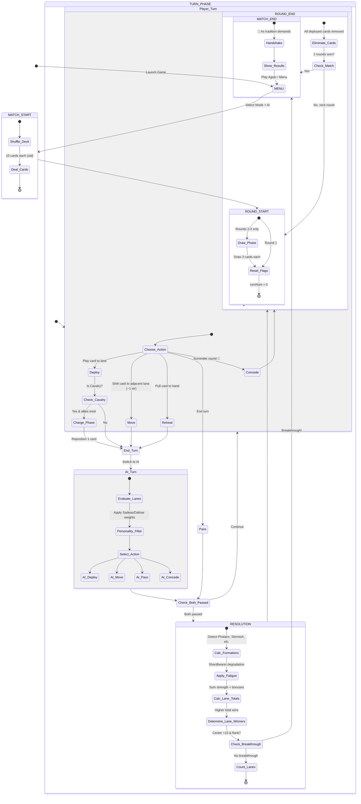

# Towers — A Rosharan Card Game

> *"The purpose of a storyteller is not to tell you how to think, but to give you questions to think about."* — Brandon Sanderson

A strategic card game based on the fictional "Towers" game from Brandon Sanderson's **The Stormlight Archive**. Built as a single-file browser game (HTML/CSS/JavaScript) with AI opponents, formations, and multiple variants.

## Game Overview

Two players deploy armies across a multi-lane battlefield. Win lanes by outmaneuvering your opponent with unit synergies and formations. Win 2 of 3 rounds to win the match — but all deployed cards are eliminated after each round, creating a brutal attrition game.

**The Tower** (Center lane) adds a secondary win condition: dominate it by 10+ margin with a flank win for an instant Breakthrough victory.

---

## Battle Flow — State Machine



---

## Unit Types & Standard Deck Mapping

| Unit | Icon | Suit | Values | Base Ability | Physical Deck |
|------|------|------|--------|-------------|---------------|
| Spearmen | ⚔️ | ♣ Clubs | 1–10 | +1 per other Spearman in lane | Clubs A–10 |
| Archers | 🏹 | ♦ Diamonds | 1–10 | +2 to each adjacent lane | Diamonds A–10 |
| Cavalry | 🐴 | ♥ Hearts | 1–10 | Charge: reposition 1 card on deploy | Hearts A–10 |
| Shardbearers | 🗡️ | ♠ Spades | 1–10 | ×2 strength, max 1 per lane, fatigues | Spades A–10 |

**Deck:** 40 cards total (4 types × 10 values). Remove J/Q/K from a standard 52-card deck to play physically.

---

## Formations

Formations are **auto-detected** during resolution and stack with base abilities.

| Formation | Requirement | Bonus | Strategy |
|-----------|------------|-------|----------|
| **Phalanx** ⚔️ | 3+ Spearmen in one lane | +3 per Spearman | Dalinar's bread & butter. Devastating in Center. |
| **Skirmish Line** 🏹🐴 | Archer + Cavalry in same lane | +3/Archer, +2/Cavalry | Flexible combo. Pairs range support with mobility. |
| **Shardwall** 🛡️ | Shardbearer + 2+ Spearmen | Negates Shardbearer fatigue | Essential for long deployments. Infantry sustains the Shard. |
| **Vanguard** 🐴 | Only Cavalry in a lane | +4 per Cavalry | Scouting/flanking. High risk, high reward isolation play. |
| **Crossfire** 🎯 | Archers in this lane + adjacent | +2 per Archer in lane | Multi-lane archer coverage. Stack archers in center. |

### Formation Detection Pseudocode

```javascript
function detectFormations(cards, laneIndex, allLanes, player, mode) {
  const formations = [];
  const spears  = cards.filter(c => c.type === 'spearmen');
  const archers = cards.filter(c => c.type === 'archers');
  const cavalry = cards.filter(c => c.type === 'cavalry');
  const shards  = cards.filter(c => c.type === 'shardbearers');

  // Phalanx: 3+ Spearmen in lane → +3 per Spearman
  if (spears.length >= 3) {
    formations.push({ name: 'Phalanx', bonus: spears.length * 3 });
  }

  // Skirmish Line: Archer + Cavalry → synergy bonus
  if (archers.length > 0 && cavalry.length > 0) {
    formations.push({
      name: 'Skirmish Line',
      bonus: archers.length * 3 + cavalry.length * 2
    });
  }

  // Shardwall: Shardbearer + 2+ Spearmen → negate fatigue
  if (shards.length > 0 && spears.length >= 2) {
    formations.push({ name: 'Shardwall', negatesFatigue: true, bonus: 0 });
  }

  // Vanguard: Only cavalry in lane → +4 each
  if (cavalry.length > 0 && cards.length === cavalry.length) {
    formations.push({ name: 'Vanguard', bonus: cavalry.length * 4 });
  }

  // Crossfire: Archers in adjacent lanes → +2 each
  const adjArcherCount = getAdjacentArcherCount(laneIndex, allLanes, player);
  if (archers.length > 0 && adjArcherCount > 0) {
    formations.push({ name: 'Crossfire', bonus: archers.length * 2 });
  }

  return formations;
}
```

---

## Fatigue & Logistics

Shardbearers are powerful but unsustainable without infantry support.

- **Shardbearer fatigue:** −1 effective strength for every 3 turns deployed within a round
- **Move penalty:** Any card moved to an adjacent lane suffers −1 strength for the round
- **Shardwall negation:** Shardbearer + 2 Spearmen cancels all fatigue
- **Minimum strength:** Cards never drop below 1 effective strength

```javascript
function calcFatigue(card, currentTurn, formations) {
  let penalty = 0;
  if (card.moved) penalty += 1;
  if (card.type === 'shardbearers' && card.deployTurn >= 0) {
    penalty += Math.floor((currentTurn - card.deployTurn) / 3);
    if (formations.some(f => f.negatesFatigue)) {
      penalty = card.moved ? 1 : 0;  // Shardwall cancels degradation
    }
  }
  return penalty;
}
```

---

## The Tower — Win Condition

The Center lane is **The Tower**, a critical strategic objective marked with 🏰.

**Standard win:** Win 2 of 3 lanes → win the round. Win 2 of 3 rounds → win the match.

**Breakthrough win:** Win The Tower (Center) by **10+ margin** AND win **at least 1 flank** → **instant match victory**, regardless of round score.

This creates a strategic fork: commit heavily to Center and risk flanks, or spread forces and play the long game.

---

## AI Personalities

### 🔴 Highprince Sadeas — "The Ruthless"

| Trait | Weight | Behavior |
|-------|--------|----------|
| Center Priority | −5 | Avoids Center, baits opponent |
| Flank Priority | +10 | Crushes flanks aggressively |
| Formation Bonus | ×0.3 | Minimal formation play |
| Card Advantage | +15 | Hoards cards, wins by attrition |
| Concede Tolerance | 60% | Freely concedes losing rounds |
| Charge Style | Aggressive | Repositions to exploit gaps |

**Play pattern:** Sadeas targets your weakest flank, deliberately under-commits to Center to lure your forces there, then overwhelms the flanks. He'll concede Round 1 to save cards for a devastating Round 2–3.

### 🔵 Highprince Dalinar — "The Honorable"

| Trait | Weight | Behavior |
|-------|--------|----------|
| Center Priority | +15 | The Tower is everything |
| Flank Priority | +5 | Still contests flanks |
| Formation Bonus | ×1.2 | Builds Phalanx religiously |
| Card Advantage | +5 | Spends for position |
| Concede Tolerance | 20% | Rarely concedes |
| Charge Style | Conservative | Repositions for defense |

**Play pattern:** Dalinar builds Phalanx formations, pushes for Center control, and aims for Breakthrough. Predictable but extremely hard to outmuscle in a straight fight. Tries to Shardwall his Shardbearers.

---

## Game Modes

| Mode | Lanes | Win | Deal | Special |
|------|-------|-----|------|---------|
| **Standard** | 3 | 2 of 3 | 10 | The Tower, Formations, Fatigue |
| **Flatface** | 3 | 2 of 3 | 10 | Opponent cards face-down until resolution |
| **Crosswise Chull** | 5 | 3 of 5 | 13 | Archers reach 2 lanes, expanded battlefield |

---

## Turn Actions

On your turn, choose **one**:

1. **Deploy** — Play a card from hand face-up to any lane. Triggers Cavalry Charge if applicable.
2. **Move** — Shift a deployed card to an **adjacent** lane. That card takes −1 strength (fatigue) for the round.
3. **Retreat** — Pull a deployed card back to your hand. Saves it from elimination but costs tempo.
4. **Pass** — Do nothing. When both players pass consecutively, the round resolves.
5. **Concede (Offer Handshake)** — Surrender the round immediately. All deployed cards still eliminated. Saves hand cards.

---

## Strength Calculation Order

```
1. Base value (card face value)
2. Type multiplier (Shardbearers ×2)
3. In-lane synergy (Spearmen +1 per other Spearman)
4. Fatigue penalty (−N from degradation/move)
5. Floor to minimum 1
6. Sum all cards in lane
7. Add Archer range support from adjacent lanes (+2 per archer)
8. Add Formation bonuses (Phalanx, Skirmish, Vanguard, Crossfire)
9. Final lane total
```

---

## File Structure

```
Stormlight_Towers/
├── towers.html          # Complete game (single file, no dependencies)
├── README.md            # This file
└── BACKLOG.md           # Future enhancements
```

---

## How to Play

1. Open `towers.html` in any modern browser
2. Select an AI opponent (Sadeas or Dalinar)
3. Choose a game mode
4. Deploy cards strategically across lanes
5. Build formations for bonus strength
6. Win 2 of 3 rounds — or achieve a Breakthrough at The Tower

---

## Physical Deck Instructions

Strip a standard 52-card deck down to A–10 in all four suits (40 cards). Map suits to units per the table above. Shuffle, deal 10 each, and track formations manually. The Tower is always the Center lane.

---

*Life before death. Strength before weakness. Journey before destination.*
